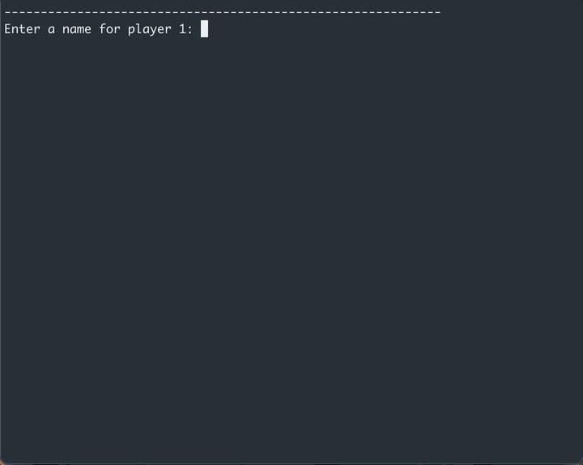
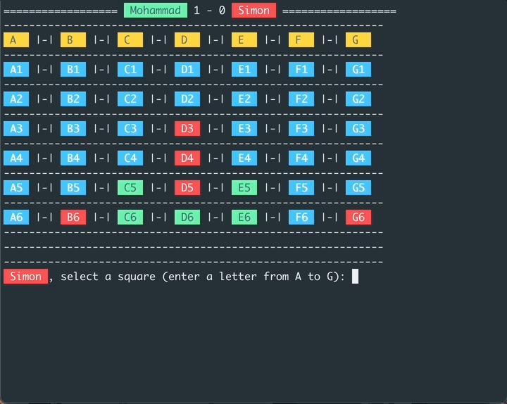
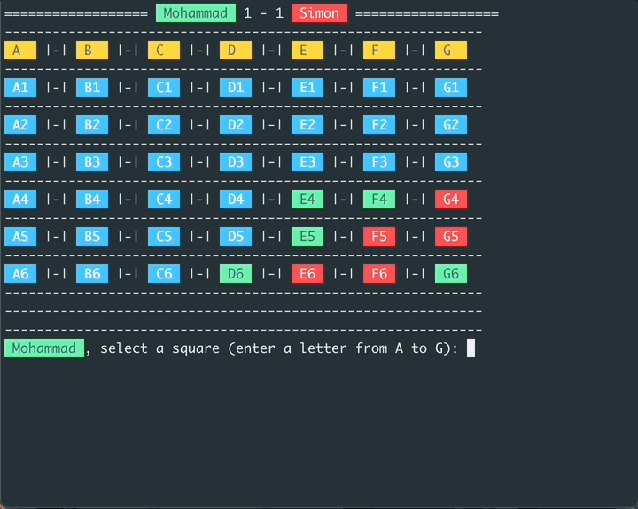
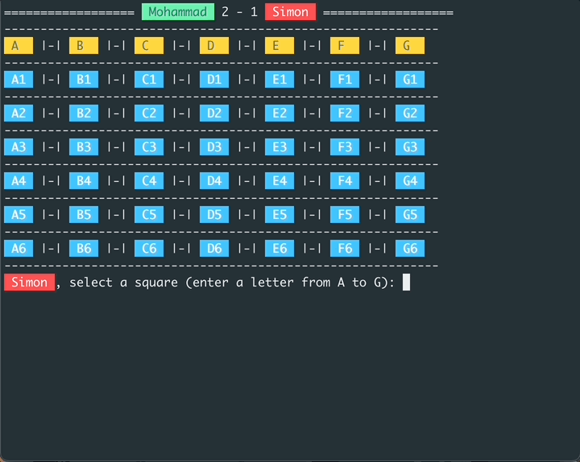

# Connect Four game

- As a part of my computer science study at Codecademy, we have to build a terminal game.

- The game is called Connect Four:
  

- The game is played on a grid that has six rows and seven columns.
- It has two players, X and Y, who alternate turns.
- Each player has a different color, Red and Green.
- When a player drops a piece, it lands in the lowest available space in the column.
- The next player continues until either four of the same pieces are connected vertically, horizontally, or diagonally.

- The game ends when either player has four in a row.
- The game also ends when the board is full and neither player has four in a row.
- When the game ends, the game can be restarted.

---
- Win vertical:

---
  
- Win diagonal:
  

---
- The game has also validations:

  

- Building this small game was really helpful for me to understand a lot of concepts in programming in addition to learning a lot of python.

